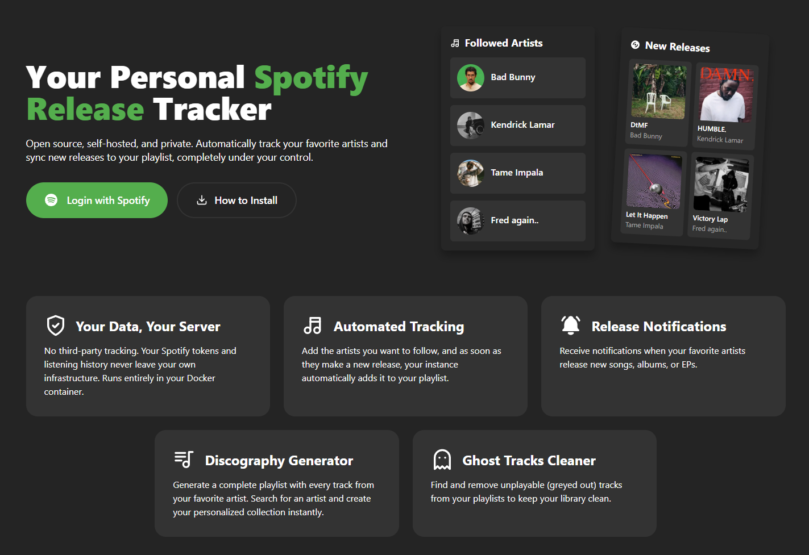
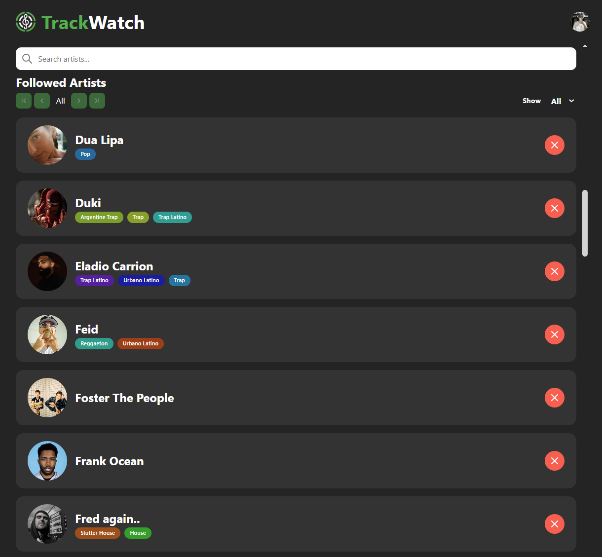

# TrackWatch


**Self-hosted music release tracker for Spotify users.** Never miss a new release from your favorite artists again.




## Why TrackWatch?

- **Your data stays yours** - Self-hosted means no third-party tracking your listening habits
- **Automatic playlist updates** - New releases are automatically added to your TrackWatch playlist
- **Never miss a release** - Checks for new music multiple times daily
- **Simple deployment** - Up and running in minutes with Docker

## Quick Start

### Prerequisites

- [Docker](https://docs.docker.com/get-docker/) installed
- A [Spotify Developer](https://developer.spotify.com/dashboard) app with Redirect URI: `http://127.0.0.1/callback`

### Option A: All-in-One Image (Recommended)

One container with everything included — no cloning, no building. Available on [GHCR](https://ghcr.io/emlopezr/trackwatch) and [Docker Hub](https://hub.docker.com/r/emlopezr/trackwatch).

```bash
docker run -d \
  --name trackwatch \
  -e SPOTIFY_CLIENT_ID=your-client-id \
  -e SPOTIFY_CLIENT_SECRET=your-client-secret \
  -e SECRET_KEY=your-secret-key \
  -v trackwatch_data:/var/lib/postgresql/data \
  -p 80:80 \
  --restart unless-stopped \
  ghcr.io/emlopezr/trackwatch:latest
```

Open **http://127.0.0.1** and you're done.

> *If port 80 is in use, change `-p 80:80` to `-p 8080:80` and access at `http://127.0.0.1:8080`*

For the full AiO guide (optional variables, Docker Compose, email setup, backups), see **[docs/DOCKER_AIO_SETUP.md](docs/DOCKER_AIO_SETUP.md)**.

### Option B: Multi-Container (Docker Compose)

Best for development or if you need independent control over each service.

```bash
git clone https://github.com/emlopezr/trackwatch.git
cd trackwatch
cp .env.docker.example .env
```

Edit `.env` with your configuration:

```env
SECRET_KEY=your-random-secret-key
DATABASE_PASSWORD=your-secure-password
SPOTIFY_CLIENT_ID=your-client-id
SPOTIFY_CLIENT_SECRET=your-client-secret
```

```bash
docker-compose up -d
```

Open **http://127.0.0.1** and you're done.

### Stop TrackWatch

```bash
# AiO
docker stop trackwatch

# Multi-container
docker-compose down
```

## Configuration

### Spotify Developer Setup

1. Go to [Spotify Developer Dashboard](https://developer.spotify.com/dashboard)
2. Click **Create App**
3. Fill in the app details:
   - **App name:** TrackWatch (or any name)
   - **App description:** Your description
   - **Redirect URI:** `http://127.0.0.1/callback`
   - **Which API/SDKs are you planning to use?** Web API
4. Click **Settings** and note your **Client ID** and **Client Secret**
5. Add these to your `.env` file

> **Important:** Spotify does not allow `localhost` as a redirect URI. You must use `127.0.0.1` for local development, or `https://` for custom domains.

### Custom Domain

If deploying to a custom domain:

1. Update the redirect URI in your Spotify app settings to match your domain:
   ```
   https://your-domain.com/callback
   ```

2. Update your `.env`:
   ```env
   VITE_SPOTIFY_REDIRECT_URI=https://your-domain.com/callback
   ```

3. Rebuild the frontend:
   ```bash
   docker-compose up -d --build frontend
   ```

### Environment Variables Reference

| Variable | Required | Default | Description |
|----------|----------|---------|-------------|
| `SECRET_KEY` | Yes | - | Django secret key for security |
| `DATABASE_PASSWORD` | Yes | - | PostgreSQL password |
| `SPOTIFY_CLIENT_ID` | Yes | - | From Spotify Developer Dashboard |
| `SPOTIFY_CLIENT_SECRET` | Yes | - | From Spotify Developer Dashboard |
| `VITE_SPOTIFY_REDIRECT_URI` | No | `http://127.0.0.1/callback` | OAuth callback URL |
| `PORT` | No | `80` | Frontend port |
| `DEBUG` | No | `False` | Django debug mode |
| `SCHEDULER_HOURS` | No | `7,14,21` | Hours to check for releases (24h) |
| `SCHEDULER_MINUTE` | No | `0` | Minute of the hour to run |
| `RESEND_API_KEY` | No | - | For email notifications |

## Features

- **Spotify Integration** - Connect your Spotify account securely via OAuth
- **Artist Tracking** - Follow artists and track their releases automatically
- **Automatic Playlist** - New releases are added to a dedicated TrackWatch playlist
- **Ghost Track Detection** - Find and remove unavailable tracks from your playlists
- **Scheduled Checks** - Automatically checks for new releases 3x daily (7am, 2pm, 9pm)

## Architecture

```
┌──────────────────────────────────────────────────────────────────────────┐
│                              Docker                                      │
├─────────────┬─────────────────────┬─────────────────┬────────────────────┤
│   Frontend  │      Backend        │    Scheduler    │     Database       │
│   (Nginx)   │     (Gunicorn)      │   (APScheduler) │    (PostgreSQL)    │
│             │                     │                 │                    │
│  React SPA  │     REST API        │   Background    │   User data +      │
│  + Reverse  │  + Spotify Auth     │   task runner   │   Track history    │
│    Proxy    │                     │                 │                    │
└─────────────┴─────────────────────┴─────────────────┴────────────────────┘
```

### Background Tasks

The `scheduler` service runs independently from the web server, checking for new releases at configured times (default: 7am, 2pm, 9pm).

**Alternative: External Triggers**

If you prefer external scheduling (e.g., n8n, system cron), you can:
1. Stop the scheduler service: `docker-compose stop scheduler`
2. Trigger updates via webhook:
   ```bash
   curl -X POST http://localhost/api/actions/releases \
     -H "X-Admin-Key: YOUR_SECRET_KEY"
   ```

## Development

For local development without Docker, see [docs/MANUAL_SETUP.md](docs/MANUAL_SETUP.md).

### Tech Stack

- **Frontend:** React 18, TypeScript, Vite, React Router 7
- **Backend:** Django 5, Django REST Framework, APScheduler, Gunicorn
- **Database:** PostgreSQL 15
- **Deployment:** Docker, Nginx

## Troubleshooting

### "Invalid redirect URI" error

Ensure the redirect URI in your Spotify app settings matches exactly:
- For local Docker: `http://127.0.0.1/callback`
- For custom domain: `https://your-domain.com/callback`

> **Note:** Spotify does not allow `localhost` - use `127.0.0.1` instead. Custom domains require HTTPS.

### Container won't start

Check logs:
```bash
docker-compose logs backend
docker-compose logs frontend
docker-compose logs scheduler
```

### Database connection issues

Ensure the database is healthy:
```bash
docker-compose ps
```

If `db` shows unhealthy, check PostgreSQL logs:
```bash
docker-compose logs db
```

### Reset everything

```bash
docker-compose down -v
docker-compose up -d --build
```

## Contributing

Contributions are welcome! Please feel free to submit a Pull Request.

## License

This project is licensed under the [MIT License](LICENSE). See also the [Data Handling Statement](legal/privacy.md) for information about how the application processes data.
